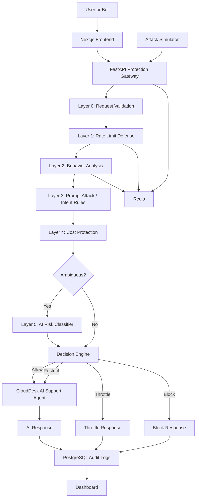

# Frontline — System Design Document

## 1. High-Level Architecture

Frontline is a security gateway that sits between public users and CloudDesk’s AI support agent.

The backend receives every chat request, evaluates it through multiple protection layers, makes a decision, logs the result, and only calls the protected AI agent when appropriate.



---

## 2. Tech Stack

### Frontend

```text
Next.js
TypeScript
Tailwind CSS
```

Used for:

* Protected chat UI
* Admin dashboard
* Attack simulator

---

### Backend

```text
FastAPI
Python
Pydantic
SQLAlchemy
```

Used for:

* API routes
* Request validation
* Protection pipeline
* Decision Engine
* AI integration
* Logging

---

### Database

```text
PostgreSQL
```

Used for:

* Request logs
* Layer results
* False positive reports
* Dashboard analytics

---

### Cache / Short-Term Memory

```text
Redis
```

Used for:

* Rate limiting counters
* Recent session messages
* Behavior analysis state
* Temporary blocks / cooldowns

---

### AI

```text
Claude API
```

Used for:

* CloudDesk AI support agent
* AI risk classifier for ambiguous requests

---

### Deployment

Local:

```text
Docker Compose
```

Cloud target:

```text
AWS ECS Fargate
AWS RDS PostgreSQL
AWS ElastiCache Redis
AWS CloudWatch
```

---

## 3. Request Lifecycle

### Step 1 — User Sends Message

Frontend sends:

```json
{
  "session_id": "session_123",
  "message": "How do I reset my password?"
}
```

---

### Step 2 — FastAPI Validates Request

Layer 0 checks:

* Message exists
* Message is not empty
* Message is not too long
* Session ID exists
* JSON body is valid

Invalid requests are blocked immediately.

---

### Step 3 — Rate Limit Defense

Layer 1 checks Redis counters.

Example Redis keys:

```text
rate:session:{session_id}:60s
rate:ip:{ip_hash}:60s
burst:session:{session_id}:10s
```

Example policy:

```text
0–10 requests per minute: allow
11–20 requests per minute: log
21–30 requests per minute: throttle
31+ requests per minute: temporary block
6+ requests in 10 seconds: throttle
```

This layer handles high-speed bot traffic.

---

### Step 4 — Behavior Analysis

Layer 2 checks recent session behavior using Redis.

Example Redis keys:

```text
recent_messages:session:{session_id}
repeated_count:session:{session_id}
cooldown:session:{session_id}
```

Signals:

* Same message repeated
* Similar request timing
* Too many restricted attempts
* Too many blocked attempts

MVP starts with exact repeated-message detection.

Example policy:

```text
Same message 2 times: allow
Same message 3–4 times: log
Same message 5–7 times: throttle
Same message 8+ times: temporary block
```

---

### Step 5 — Prompt Attack / Intent Rules

Layer 3 checks for obvious attempts to manipulate the AI agent.

This layer uses deterministic rules and regex.

Bad rule:

```text
contains "ignore" → block
```

This is too broad and causes false positives.

Better rules:

```text
"ignore" near "system instructions" → restrict or block
"reveal" near "system prompt" → block
"show" near "developer message" → restrict or block
"API key" + "your/internal/secret" → block
"API key" + "how do I create" → allow or escalate
```

Possible outcomes:

```text
CONTINUE
RESTRICT
BLOCK
ESCALATE_TO_AI_CLASSIFIER
```

Borderline requests should be escalated to the AI classifier.

---

### Step 6 — Cost Protection

Layer 4 estimates whether the request could create an expensive AI response.

Signals:

* Requested word count
* Requested number of examples
* Very long input
* “Repeat forever”
* “Write a full book”
* “Generate 500 examples”
* Estimated token usage

Example policy:

```text
500 words: allow
1,500–3,000 words: allow
5,000–10,000 words: restrict output length
10,000+ words: restrict or block
repeat forever: block
500 examples: restrict or block
```

Restriction example:

```text
max_output_tokens = 800
```

User-facing response:

> I can help, but I’ll provide a shorter version first.

---

### Step 7 — AI Risk Classifier

Layer 5 only runs for ambiguous requests.

The classifier receives:

```json
{
  "message": "user message",
  "layer_findings": ["borderline prompt intent"],
  "task": "classify risk"
}
```

It returns:

```json
{
  "label": "prompt_attack",
  "confidence": 0.82,
  "explanation": "The request appears to ask the assistant to ignore internal instructions.",
  "recommended_action": "RESTRICT"
}
```

Possible labels:

```text
normal
suspicious
prompt_attack
cost_abuse
bot_abuse
unknown
```

The classifier does not make the final decision.
The Decision Engine does.

---

## 4. Decision Engine

The Decision Engine combines layer evaluations.

Each layer returns:

```json
{
  "layer": "rate_limit",
  "category": "bot_rate_abuse",
  "severity": "high",
  "recommended_action": "THROTTLE",
  "risk_delta": 35,
  "reason_code": "HIGH_REQUEST_RATE",
  "explanation": "The session sent too many requests in a short time."
}
```

Action strength:

```text
CONTINUE < LOG_ONLY < RESTRICT < THROTTLE < BLOCK
```

The Decision Engine chooses the strongest action.

Example:

```text
Layer 1: CONTINUE
Layer 2: LOG_ONLY
Layer 3: RESTRICT
Layer 4: CONTINUE
Final action: RESTRICT
```

If a layer returns a critical action, the pipeline can stop early.

Example:

```text
Layer 1 returns BLOCK for 100 requests in 60 seconds.
The system does not call the AI classifier or protected AI agent.
```

---

## 5. Risk Score

Risk score is used for:

* Dashboard analytics
* Severity comparison
* Request logs
* Explanations
* Simulator results

Risk score is not the only decision-maker.

Initial risk deltas:

```text
Rate limit abuse: +35
Repeated message pattern: +25
Slow bot behavior: +20
Prompt attack intent: +40
Cost abuse request: +30
AI classifier suspicious: +20
AI classifier prompt_attack: +35
AI classifier cost_abuse: +30
```

Final score is capped at 100.

Example:

```text
Repeated message pattern: +25
Cost abuse request: +30
Final risk score: 55
Final action: RESTRICT
```

---

## 6. API Endpoints

### Chat

```http
POST /api/chat
```

Request:

```json
{
  "session_id": "session_123",
  "message": "How do I reset my password?"
}
```

Response:

```json
{
  "decision": "ALLOW",
  "risk_score": 5,
  "reason_codes": [],
  "response": "You can reset your password from Account Settings."
}
```

---

### Dashboard Metrics

```http
GET /api/dashboard/metrics
```

Returns:

```json
{
  "total_requests": 1200,
  "allowed_requests": 900,
  "blocked_requests": 100,
  "throttled_requests": 80,
  "restricted_requests": 120,
  "estimated_cost_saved_usd": 12.45,
  "ai_classifier_usage_rate": 0.31
}
```

---

### Recent Logs

```http
GET /api/dashboard/logs
```

Returns recent request logs with redacted messages.

---

### False Positive Report

```http
POST /api/false-positive-reports
```

Request:

```json
{
  "request_log_id": "log_123",
  "reason": "This was a normal support question."
}
```

---

### Attack Simulator

```http
POST /api/simulator/run
```

Request:

```json
{
  "scenario": "spam_bot",
  "request_count": 50
}
```

---

## 7. Database Design

### request_logs

Stores one row per request.

Fields:

```text
id
session_id
ip_hash
raw_message
redacted_message
message_hash
message_length
contains_pii
risk_score
final_action
reason_codes
ai_classifier_used
ai_classifier_label
ai_classifier_confidence
ai_classifier_explanation
input_tokens_estimated
output_tokens_estimated
estimated_cost_usd
actual_cost_usd
estimated_cost_saved_usd
created_at
```

Notes:

* `raw_message` is allowed during development/admin review.
* `redacted_message` is used for dashboard display.
* `ip_hash` is stored instead of raw IP.

---

### layer_results

Stores each layer’s evaluation for a request.

Fields:

```text
id
request_log_id
layer_name
category
severity
recommended_action
risk_delta
reason_code
explanation
created_at
```

---

### false_positive_reports

Stores reports from users/admins when a request may have been wrongly blocked or restricted.

Fields:

```text
id
request_log_id
reason
status
created_at
reviewed_at
```

Possible statuses:

```text
open
reviewed
accepted
rejected
```

---

## 8. Redaction System

Before storing or displaying messages, the backend creates a redacted version.

Sensitive patterns:

```text
emails
API keys
access tokens
phone numbers
secret-looking strings
```

Example:

```text
Raw:
My email is nat@example.com and my API key is sk-abc123.

Redacted:
My email is [EMAIL] and my API key is [SECRET].
```

MVP approach:

* Store raw message in development mode.
* Store redacted message always.
* Show redacted message on dashboard.
* Hash message for repeat detection and privacy-friendly lookup.

---

## 9. Cost Estimation System

Cost estimation uses token estimates and configured model prices.

Formula:

```text
estimated_cost =
(input_tokens / 1,000,000 × input_price_per_million)
+
(output_tokens / 1,000,000 × output_price_per_million)
```

Configuration:

```text
AI_INPUT_PRICE_PER_1M_TOKENS
AI_OUTPUT_PRICE_PER_1M_TOKENS
```

Blocked request cost saved:

```text
estimated_cost_saved = estimated_cost_that_would_have_been_spent
```

Restricted request cost saved:

```text
estimated_cost_saved = unrestricted_estimated_cost - restricted_actual_or_estimated_cost
```

---

## 10. Redis Design

Redis is used for fast temporary state.

Example keys:

```text
rate:session:{session_id}:60s
rate:ip:{ip_hash}:60s
burst:session:{session_id}:10s
recent_messages:session:{session_id}
cooldown:session:{session_id}
blocked:session:{session_id}
```

Redis data should expire automatically.

Example TTLs:

```text
rate limit counters: 60 seconds
burst counters: 10 seconds
recent messages: 10 minutes
cooldowns: 1–5 minutes
temporary blocks: 5–15 minutes
```

---

## 11. Security Considerations

### Privacy

* Store hashed IPs, not raw IPs.
* Redact sensitive message content.
* Avoid exposing exact detection rules to users.
* Keep raw messages restricted to development/admin review.

### API Safety

* Validate request bodies with Pydantic.
* Limit request body size.
* Use environment variables for API keys.
* Never expose AI provider keys to the frontend.

### Abuse Prevention

* Rate limit by session and IP hash.
* Use Redis cooldowns for throttled sessions.
* Stop obvious attacks before calling AI.
* Avoid sending blocked requests to the protected AI agent.

---

## 12. Scaling Considerations

### Why Redis?

Rate limits and recent behavior need fast shared memory.

Redis is better than PostgreSQL for:

* Counters
* Cooldowns
* Recent messages
* Temporary blocks

### Why PostgreSQL?

PostgreSQL is better for:

* Permanent logs
* Dashboard queries
* False positive reports
* Historical analytics

### Why Layered Design?

Layered design reduces cost because simple checks run before expensive AI calls.

Example:

```text
A spam bot sends 100 requests.
Rate limit layer catches it.
AI classifier is skipped.
Protected AI agent is skipped.
Cost is saved.
```

---

## 13. Local Development Architecture

```text
Docker Compose
├── frontend: Next.js
├── backend: FastAPI
├── postgres: PostgreSQL
└── redis: Redis
```

Local services:

```text
Frontend: http://localhost:3000
Backend: http://localhost:8000
PostgreSQL: localhost:5432
Redis: localhost:6379
```

---

## 14. Cloud Deployment Architecture

Target AWS setup:

```text
Next.js Frontend
↓
FastAPI Backend on ECS Fargate
↓
PostgreSQL on RDS
↓
Redis on ElastiCache
↓
Logs / Metrics in CloudWatch
```

Environment variables:

```text
DATABASE_URL
REDIS_URL
ANTHROPIC_API_KEY
AI_INPUT_PRICE_PER_1M_TOKENS
AI_OUTPUT_PRICE_PER_1M_TOKENS
RAW_MESSAGE_LOGGING_ENABLED
ENVIRONMENT
```

---

## 15. Project Folder Structure

```text
agent-shield/
  frontend/
    app/
    components/
    lib/
  backend/
    app/
      api/
      core/
      models/
      schemas/
      services/
      guardrails/
        validation.py
        rate_limit.py
        behavior.py
        prompt_rules.py
        cost_protection.py
        ai_classifier.py
      decision_engine.py
      database.py
      redis_client.py
    tests/
  docs/
    planning.md
    system_design.md
  docker-compose.yml
  README.md
```

---

## 16. MVP Build Order

Build in this order:

```text
1. FastAPI backend health check
2. PostgreSQL connection
3. Redis connection
4. Basic chat endpoint
5. Claude-powered CloudDesk support response
6. Request logging
7. Request validation
8. Rate limiting
9. Behavior analysis
10. Prompt attack rules
11. Cost protection
12. Decision Engine
13. AI classifier
14. Dashboard
15. Attack simulator
16. Tests
17. Docker polish
18. Cloud deployment
```

Do not build the dashboard first.
The backend protection system is the product.
